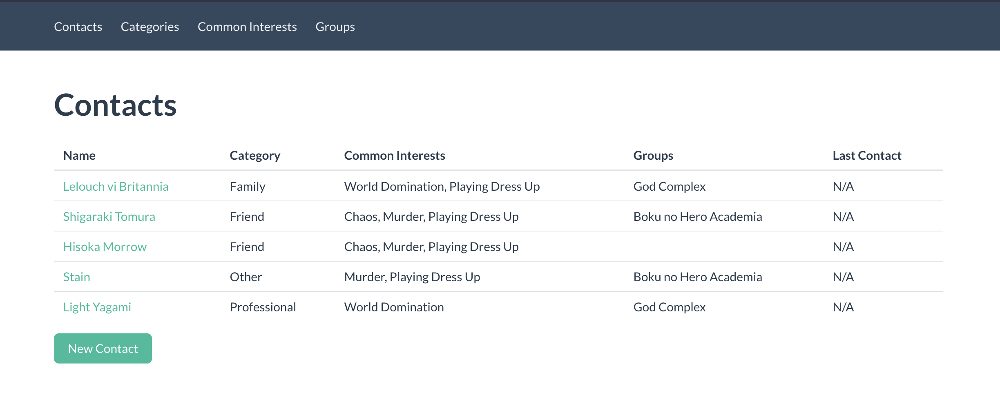

# Contact Repo

This is a basic CRUD app to keep track of your contacts, built with rails, rpsec, sqlite and bulma. I made it mainly as a way to learn rails.

If you're actually interested in a similar kind of tool you'd probably be better off with some sort of CRM. From what I've seen [Notion](https://www.notion.so/) might be a good solution with its intuitive databases.